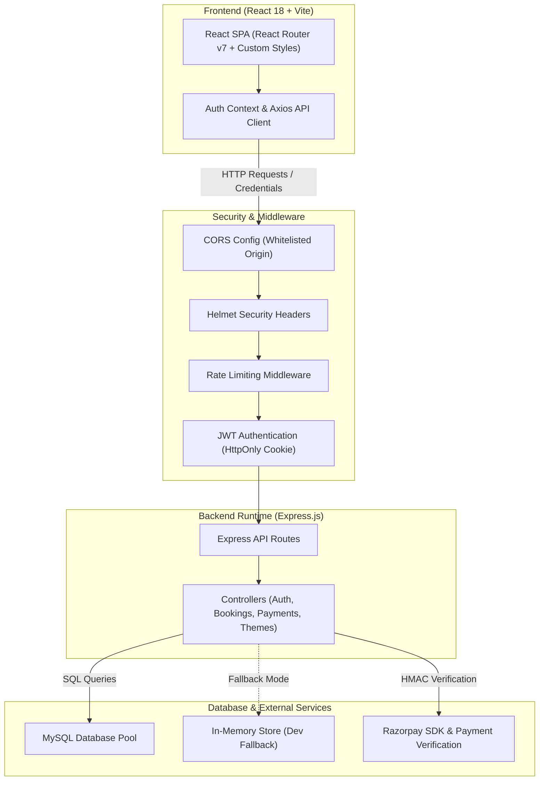
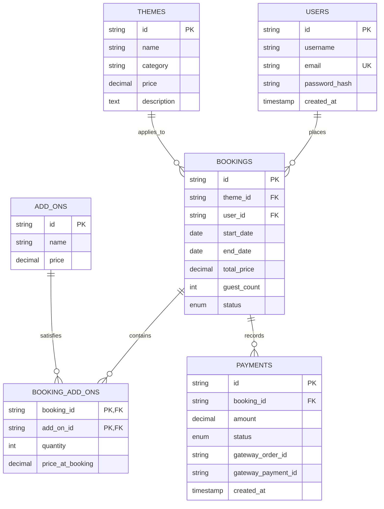

<div align="center">
  
  <h1>⚡ EventPulse</h1>
  <p><strong>A Full-Stack Event Management & Dynamic Booking Platform</strong></p>

  <p>
    <a href="https://nodejs.org"></a>
    <a href="https://react.dev"></a>
    <a href="https://expressjs.com"></a>
    <a href="https://www.mysql.com"></a>
    <a href="https://razorpay.com"></a>
    <a href="./LICENSE"></a>
  </p>

  <p>
    <a href="#-overview">Overview</a> •
    <a href="#-key-features">Key Features</a> •
    <a href="#-system-architecture">Architecture</a> •
    <a href="#-security--best-practices">Security</a> •
    <a href="#-database-design">Database Design</a> •
    <a href="#-api-reference">API Reference</a> •
    <a href="#%EF%B8%8F-getting-started">Getting Started</a>
  </p>
</div>

---

## 📋 Overview

**EventPulse** is a responsive full-stack event management and booking platform built with **React, Node.js, Express, and MySQL**. It provides end-to-end functionality for users to browse themed event setups (Weddings, Corporate Gatherings, Birthdays, Travel), calculate dynamic pricing based on custom add-ons and guest tiers, reserve event dates, and make secure online payments via Razorpay.

The project features a **decoupled architecture**, robust **RESTful APIs**, **role-based frontend views** (Client Portal & Admin Dashboard), and a **dual-mode database layer** that automatically falls back to an in-memory data store if MySQL is not running locally.

---

## ✨ Key Features

- **🎨 Dynamic Theme Catalog**: Filter and view details for various event categories with transparent pricing structures.
- **🧮 Interactive Event Cost Calculator**: Estimate total event expenses in real time based on guest counts, venue selection, and optional add-on services.
- **🔐 Secure Authentication**: User signup and login with JWT tokens delivered securely via `HttpOnly`, `SameSite` cookies to mitigate XSS vulnerabilities.
- **📅 Date Availability & Booking**: Real-time validation of availability, preventing overlapping slot bookings.
- **💳 Integrated Razorpay Payments**: Order creation, payment modal handling, and server-side HMAC SHA-256 signature verification.
- **📊 Admin Dashboard**: Administrative controls to review all bookings, track total revenue, update status, and manage event offerings.
- **💾 Flexible Data Persistence**: MySQL database connection pool with automatic fallback to a mock in-memory database store for immediate local evaluation without external database setup.

---

## 🏗 System Architecture



---

## 🛡 Security & Best Practices

| Security Feature | Implementation Detail | Benefit |
|---|---|---|
| **Token Storage** | JWT tokens stored in `HttpOnly`, `SameSite=Strict` cookies | Protects tokens from JavaScript access and XSS theft |
| **SQL Injection Defense** | Parameterized queries using `mysql2` prepared statements (`pool.execute`) | Prevents malicious SQL injection attacks |
| **Server-Side Price Calculation** | Total prices calculated exclusively on the backend using theme rates and add-on lookups | Prevents client-side price manipulation |
| **Payment Verification** | HMAC SHA-256 signature verification on Razorpay payment callbacks | Ensures payment integrity before updating booking status |
| **IDOR Protection** | Ownership verification checks (`WHERE user_id = ? AND id = ?`) on user-scoped endpoints | Prevents unauthorized access to other users' bookings |
| **Rate Limiting & Headers** | Express Rate Limit on auth routes and Helmet middleware | Helps prevent brute-force attacks and standard web vulnerabilities |

---

## 💾 Database Design

The MySQL database schema uses a relational layout to handle users, themes, bookings, add-ons, and payment logs.



### Schema Highlights
- **Historical Price Auditing**: The `booking_add_ons` table stores `price_at_booking` to retain accurate financial records even if global add-on prices change later.
- **Soft Deletion**: Key entities maintain a `deleted_at` column for non-destructive records management.
- **Foreign Key Constraints**: Enforces data integrity across bookings, users, and themes.

---

## 🔌 API Reference

### Auth Endpoints (`/api/auth`)
| Method | Endpoint | Access | Description |
|---|---|---|---|
| `POST` | `/api/auth/register` | Public | Register a new user account |
| `POST` | `/api/auth/login` | Public | Authenticate user & set HttpOnly JWT cookie |
| `POST` | `/api/auth/logout` | Authenticated | Clear authentication cookie |
| `POST` | `/api/auth/forgot-password` | Public | Initiate password reset (anti-enumeration protection & SHA-256 token hashing) |
| `POST` | `/api/auth/reset-password` | Public | Verify reset token & update user password (15-min expiration constraint) |

### Booking Endpoints (`/api/bookings`)
| Method | Endpoint | Access | Description |
|---|---|---|---|
| `GET` | `/api/bookings/availability` | Public | Check date availability for event themes |
| `POST` | `/api/bookings` | Authenticated | Create a new booking with server-calculated pricing |
| `GET` | `/api/bookings/user` | Authenticated | Fetch active bookings for the logged-in user |
| `GET` | `/api/bookings/:id` | Authenticated | Fetch specific booking details (ownership validated) |
| `POST` | `/api/bookings/:id/cancel` | Authenticated | Cancel an existing booking |

### Payment Endpoints (`/api/payments`)
| Method | Endpoint | Access | Description |
|---|---|---|---|
| `POST` | `/api/payments/razorpay/order` | Authenticated | Initialize Razorpay order and save pending payment |
| `POST` | `/api/payments/razorpay/verify` | Authenticated | Verify HMAC signature and confirm payment status |
| `GET` | `/api/payments/history` | Authenticated | View payment transaction history for user |

---

## ⚙️ Getting Started

### Prerequisites
- **Node.js**: `v18.0.0` or higher
- **npm**: `v9.0.0` or higher
- **MySQL**: (Optional – if MySQL is not configured, the app will run using the built-in in-memory dataset)

### 1. Clone the Repository
```bash
git clone https://github.com/dipambarman/project-event-management.git
cd project-event-management
```

### 2. Configure Environment Variables
Create a `.env` file in the root directory:
```env
PORT=5000
NODE_ENV=development
DB_HOST=localhost
DB_USER=root
DB_PASSWORD=your_password
DB_NAME=event_management
JWT_SECRET=your_jwt_secret_key
RAZORPAY_KEY_ID=your_razorpay_key_id
RAZORPAY_KEY_SECRET=your_razorpay_key_secret

# SMTP Email Configuration (Nodemailer)
SMTP_HOST=smtp.gmail.com
SMTP_PORT=587
SMTP_USER=your_email@gmail.com
SMTP_PASS=your_app_password
EMAIL_FROM="EventPulse" <noreply@eventpulse.io>
```

### 3. Setup Backend
```bash
cd backend
npm install
npm run dev
```
*Backend server runs on `http://localhost:5000`*

### 4. Setup Frontend
```bash
cd ../frontend
npm install
npm run dev
```
*Frontend dev server runs on `http://localhost:5173`*

---

## 📂 Project Structure

```plaintext
project-event-management/
├── README.md                    # Project documentation
├── backend/
│   ├── config/                  # Configuration & constants
│   ├── controllers/             # Request handlers & business logic
│   │   ├── addonController.js
│   │   ├── analyticsController.js
│   │   ├── authController.js
│   │   ├── bookingController.js
│   │   ├── paymentController.js
│   │   └── themeController.js
│   ├── db.js                    # MySQL pool initialization with in-memory fallback
│   ├── middleware/              # Auth & security middleware
│   ├── migrations/              # SQL schema scripts (`create_tables.sql`)
│   ├── routes/                  # Express route definitions
│   └── server.js                # Server entrypoint
└── frontend/
    ├── src/
    │   ├── components/          # Reusable UI components (Navbar, ThemeCard, etc.)
    │   ├── pages/               # Page components (Home, Booking, ClientPortal, AdminDashboard)
    │   ├── services/            # Axios API client setup
    │   ├── App.jsx              # Routing & main component wrapper
    │   └── main.jsx             # React DOM entrypoint
    ├── vite.config.js           # Vite configuration & API proxy
    └── package.json             # Frontend dependencies
```

---

## 📄 License

This project is licensed under the **MIT License**. See the `LICENSE` file for details.
