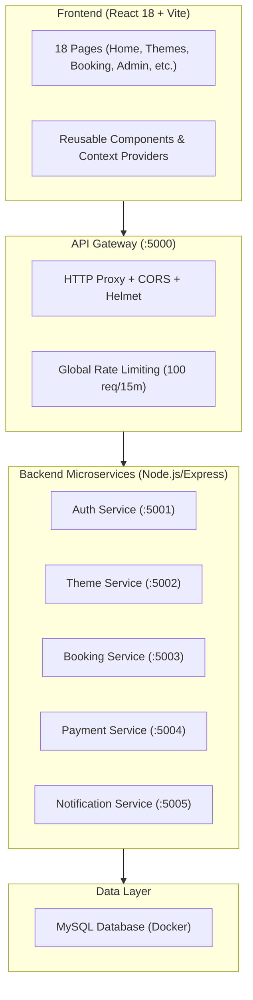
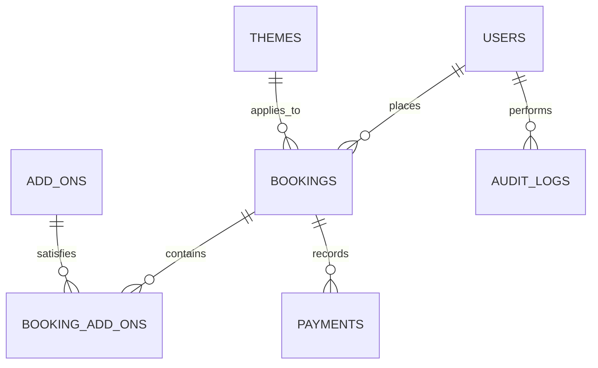

<div align="center">
  
  <h1>⚡ EventPulse Enterprise</h1>
  <p><strong>A Full-Stack Event Management & Dynamic Booking Platform</strong></p>

  <p>
    <a href="https://nodejs.org"></a>
    <a href="https://react.dev"></a>
    <a href="https://expressjs.com"></a>
    <a href="https://www.mysql.com"></a>
    <a href="https://www.docker.com/"></a>
    <a href="https://razorpay.com"></a>
    <a href="./LICENSE"></a>
  </p>

  <p>
    <a href="#-overview">Overview</a> •
    <a href="#-key-features">Key Features</a> •
    <a href="#-system-architecture">Architecture</a> •
    <a href="#-security--best-practices">Security</a> •
    <a href="#-database-design">Database Design</a> •
    <a href="#%EF%B8%8F-getting-started">Getting Started</a>
  </p>
</div>

---

## 📋 Overview

**EventPulse Enterprise** is a scalable, microservices-driven event management and booking platform. It provides end-to-end functionality for users to browse themed event setups (Weddings, Corporate Gatherings, Birthdays), calculate dynamic pricing, reserve event dates, and make secure online payments.

The project features a **Microservices Architecture** orchestrated via **Docker Compose**, an **API Gateway** for centralized routing and rate-limiting, and robust backend services (Auth, Booking, Theme, Payment, Notification) all backed by a normalized **MySQL** database.

---

## ✨ Key Features

- **🎨 Dynamic Theme Catalog**: Filter and view details for various event categories with transparent pricing structures, powered by the Theme Service.
- **🧮 Interactive Event Cost Calculator**: Estimate total event expenses in real time based on guest counts, venue selection, and optional add-on services.
- **🔐 Secure Authentication & RBAC**: JWT tokens delivered via `HttpOnly`, `SameSite` cookies. Strict Role-Based Access Control separates Client and Admin privileges.
- **📅 Date Availability & Booking**: Real-time validation of availability, preventing overlapping slot bookings.
- **💳 Integrated Razorpay Payments**: Order creation, payment modal handling, and server-side HMAC SHA-256 signature verification.
- **📧 Automated Notifications**: Automated transactional emails (Booking Confirmations, Payment Receipts) dispatched asynchronously via the Notification Service.
- **📊 Admin Dashboard**: Full administrative CRUD capabilities to review bookings, track revenue analytics, update statuses, and manage event offerings.
- **📝 Audit Logging**: Immutable database logs tracking critical actions (logins, bookings, cancellations) across microservices.
- **🐳 Docker Orchestration**: Seamless local development via `docker-compose up`, automatically provisioning the API Gateway, 5 Node.js microservices, and a seeded MySQL container.

---

## 🏗 System Architecture



---

## 🛡 Security & Best Practices

| Security Feature | Implementation Detail | Benefit |
|---|---|---|
| **Microservices Isolation** | 6 distinct services mapped via an API Gateway | Limits blast radius and allows independent scaling |
| **Token Storage** | JWT tokens stored in `HttpOnly`, `SameSite=Strict` cookies | Protects tokens from JavaScript access and XSS theft |
| **Validation & Rate Limiting** | `express-validator` on core routes, `express-rate-limit` on the gateway | Prevents malformed data injection and brute-force attacks |
| **Payment Verification** | HMAC SHA-256 signature verification on Razorpay callbacks | Ensures payment integrity before updating booking status |
| **Audit Trails** | Centralized `auditService` writing to an `audit_logs` table | Tracks critical user lifecycle and financial events |
| **Role-Based Access Control** | Dedicated `adminOnly` middleware | Restricts Executive Dashboard and catalog mutations |

---

## 💾 Database Design

The MySQL database schema is highly normalized (3NF) to handle users, themes, bookings, add-ons, payments, and audit logs.



### Schema Highlights
- **Historical Price Auditing**: The `booking_add_ons` table stores `price_at_booking` to retain accurate financial records even if global add-on prices change later.
- **Audit Logging**: The `audit_logs` table persistently tracks user actions across services.
- **Automated Seeding**: `backend/migrations/` executes automatically on Docker startup, creating the schema and seeding default catalog themes.

---

## ⚙️ Getting Started

### Prerequisites
- **Docker** and **Docker Compose**
- **Node.js**: `v18.0.0` or higher (if running services individually outside Docker)
- **npm**: `v9.0.0` or higher

### 1. Clone the Repository
```bash
git clone https://github.com/dipambarman/project-event-management.git
cd project-event-management
```

### 2. Configure Environment Variables
Duplicate the example environment file:
```bash
cp .env.example .env
```
Edit `.env` to include your actual **Razorpay Keys** and **SMTP Email Credentials**.

### 3. Run with Docker Compose (Recommended)
This will spin up the MySQL database, API Gateway, and all 5 microservices automatically.
```bash
docker-compose up --build
```
*The API Gateway will be available on `http://localhost:5000`.*

### 4. Setup Frontend
In a new terminal window:
```bash
cd frontend
npm install
npm run dev
```
*The React application will be available on `http://localhost:5173`.*

---

## 🧪 Testing

Test harnesses are configured for both frontend and backend development:
- **Backend (Jest & Supertest)**: `cd backend/services/booking-service && npm test`
- **Frontend (Vitest & React Testing Library)**: `cd frontend && npm test`

---

## 📂 Project Structure

```plaintext
project-event-management/
├── docker-compose.yml           # Multi-container orchestration
├── backend/
│   ├── migrations/              # SQL Schema & Seeder scripts
│   └── services/                # Microservices Ecosystem
│       ├── api-gateway/         # Reverse proxy & Rate limiting
│       ├── auth-service/        # Registration, Login, JWT, Password Resets
│       ├── booking-service/     # Availability, CRM, and Booking Core
│       ├── notification-service/# Email (Nodemailer) & Web Push
│       ├── payment-service/     # Razorpay Integrations & Order history
│       └── theme-service/       # Event Catalog & Add-ons CRUD
└── frontend/
    ├── src/
    │   ├── component/           # Reusable UI components
    │   ├── context/             # AuthContext, ToastContext
    │   ├── page/                # React Router Views
    │   ├── styles/              # Centralized CSS Architecture
    │   └── App.jsx              # Application router
    └── vite.config.js
```

---

## 📄 License

This project is licensed under the **MIT License**. See the `LICENSE` file for details.
