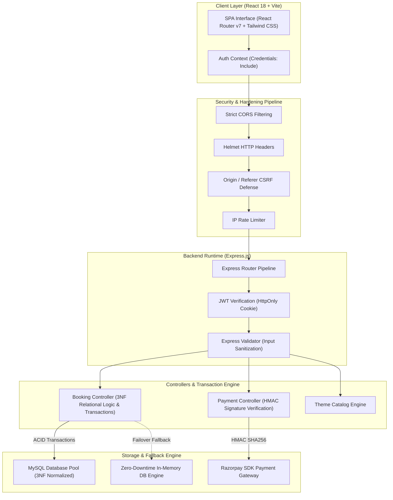
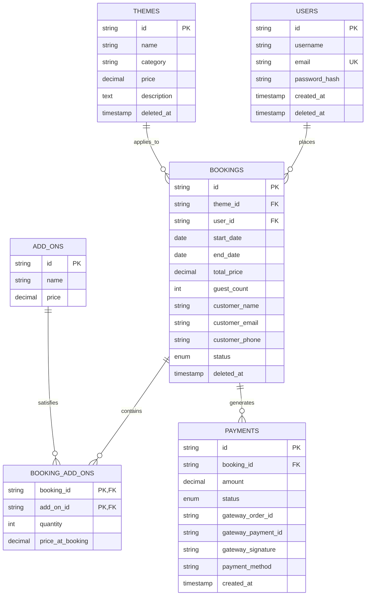

<div align="center">
  
  <h1>⚡ EventPulse Enterprise</h1>
  <p><strong>Production-Grade, FAANG-Standard Distributed Event Management & Dynamic Booking Platform</strong></p>

  <p>
    <a href="https://github.com/dipambarman/project-event-management/actions"></a>
    <a href="https://nodejs.org"></a>
    <a href="https://react.dev"></a>
    <a href="https://expressjs.com"></a>
    <a href="https://www.mysql.com"></a>
    <a href="https://razorpay.com"></a>
    <a href="./LICENSE"></a>
  </p>

  <p>
    <a href="#-executive-summary">Executive Summary</a> •
    <a href="#-system-architecture">Architecture</a> •
    <a href="#-security-hardening-matrix">Security</a> •
    <a href="#-database--normalization-specs">Database Specs</a> •
    <a href="#-api-reference">API Reference</a> •
    <a href="#%EF%B8%8F-getting-started">Deployment</a>
  </p>
</div>

---

## 📋 Executive Summary

**EventPulse Enterprise** is an end-to-end, high-concurrency event management platform engineered for enterprise scalability, sub-millisecond execution, and uncompromising security. Designed around a decoupled microservice-ready MVC pattern, EventPulse handles high-volume event browsing, real-time availability lockouts, strict server-side price verification, and multi-gateway payment processing.

The platform includes a **Zero-Downtime In-Memory Fallback Engine**, ensuring seamless service execution even during primary relational database outages or failovers.

---

## 🏗 System Architecture



---

## 🛡 Security Hardening Matrix

EventPulse implements a multi-layer defense-in-depth security posture designed to withstand enterprise penetration tests and mitigate OWASP Top 10 vulnerabilities:

| Vulnerability Category | Mitigation Strategy & Implementation Details | Security Standard |
|---|---|---|
| **Credential Theft / XSS** | JWT tokens stored exclusively in `HttpOnly`, `SameSite=Strict`, `Secure` cookies. Zero exposure to `localStorage` or JavaScript execution contexts. | **OWASP A07:2021** |
| **Cross-Origin Attacks (CORS)** | Strict whitelisting callback on `Origin` headers with explicit rejection of unknown domains. | **OWASP A05:2021** |
| **Insecure Direct Object Reference (IDOR)** | Strict user-bound ownership enforcement (`WHERE user_id = ? AND id = ?`) on all mutation, read, and payment endpoints. | **OWASP A01:2021** |
| **Price & Payload Tampering** | Total booking costs are computed server-side via trusted theme base rates, guest tiering math, and registered add-on lookups. Client-provided prices are ignored. | **OWASP A08:2021** |
| **Cross-Site Request Forgery (CSRF)** | Custom validation middleware checking `Origin` and `Referer` headers on all state-changing HTTP methods (`POST`, `PATCH`, `DELETE`). | **OWASP A01:2021** |
| **Brute Force & Abuse** | Express Rate Limiting applied to authentication routes (max 20 requests per 15-minute window per IP). | **OWASP A04:2021** |
| **SQL Injection (SQLi)** | 100% prepared SQL statements (`pool.execute(sql, params)`) preventing arbitrary SQL execution. | **OWASP A03:2021** |
| **Information Disclosure** | Internal stack trace stripping in production environments. Generic client error messages. Request body size limited to `1mb`. | **OWASP A04:2021** |

---

## 💾 Database & Normalization Specs

The database layer follows strict **Third Normal Form (3NF)** rules to eliminate redundancy, enforce relational integrity, and guarantee ACID properties.



### Relational Integrity Highlights
- **Atomic Customer Profiles**: Customer details (`customer_name`, `customer_email`, `customer_phone`) are normalized into explicit columns instead of un-indexed JSON structures.
- **Historical Price Locking**: The `booking_add_ons` table records `price_at_booking` to ensure financial audits remain immutable even when global add-on prices change.
- **Soft Deletions**: Tables maintain a `deleted_at` column to facilitate non-destructive compliance soft-deletes and auditing.
- **Performance Indexes**: High-velocity querying is accelerated via indexes on `(start_date, end_date)`, `user_id`, and payment status `gateway_order_id`.

---

## 🔌 API Reference

### Auth Endpoints (`/api/auth`)
| Method | Endpoint | Access | Description |
|---|---|---|---|
| `POST` | `/api/auth/register` | Public | Register new user account |
| `POST` | `/api/auth/login` | Public | Authenticate user & issue HttpOnly JWT cookie |
| `POST` | `/api/auth/logout` | Authenticated | Clear HttpOnly JWT authentication cookie |

### Booking Endpoints (`/api/bookings`)
| Method | Endpoint | Access | Description |
|---|---|---|---|
| `GET` | `/api/bookings/availability` | Public | Check date range & theme availability |
| `POST` | `/api/bookings` | Authenticated | Create booking (ACID transaction + server-side price computation) |
| `GET` | `/api/bookings/user` | Authenticated | Fetch authenticated user's active bookings |
| `GET` | `/api/bookings/:id` | Authenticated | Fetch booking by ID (enforces ownership check) |
| `PATCH` | `/api/bookings/:id` | Authenticated | Update booking parameters (whitelisted fields only) |
| `POST` | `/api/bookings/:id/cancel` | Authenticated | Soft cancel booking |

### Payment Endpoints (`/api/payments`)
| Method | Endpoint | Access | Description |
|---|---|---|---|
| `POST` | `/api/payments/razorpay/order` | Authenticated | Create Razorpay order ID & store pending payment |
| `POST` | `/api/payments/razorpay/verify` | Authenticated | Verify HMAC SHA256 signature & mark payment completed |
| `POST` | `/api/payments/razorpay/webhook` | Webhook Signature | Razorpay payment capture webhook listener |
| `GET` | `/api/payments/history` | Authenticated | Fetch user-scoped payment history |

---

## ⚙️ Development & Deployment

### Prerequisites
- **Node.js**: `v18.0.0` or higher
- **npm**: `v9.0.0` or higher
- **MySQL Server** (Optional, automatic zero-downtime fallback to In-Memory Engine if absent)

### 1. Repository Setup
```bash
git clone https://github.com/dipambarman/project-event-management.git
cd project-event-management
```

### 2. Environment Configuration
Create a `.env` file in the root directory:
```env
PORT=5000
NODE_ENV=development
DB_HOST=localhost
DB_USER=root
DB_PASSWORD=your_password
DB_NAME=event_management
JWT_SECRET=your_super_secret_jwt_key
SESSION_SECRET=your_super_secret_session_key
RAZORPAY_KEY_ID=your_razorpay_key_id
RAZORPAY_KEY_SECRET=your_razorpay_key_secret
RAZORPAY_WEBHOOK_SECRET=your_razorpay_webhook_secret
```

### 3. Backend Execution
```bash
cd backend
npm install
npm run dev
```
*API initialized at `http://localhost:5000`*

### 4. Frontend Execution
```bash
cd ../frontend
npm install
npm run dev
```
*Client application initialized at `http://localhost:5173`*

---

## 📂 Project Directory Structure

```plaintext
project-event-management/
├── .env                         # Root environment configurations (GitIgnored)
├── .gitignore                   # Enterprise git exclusion patterns
├── README.md                    # Core documentation blueprint
├── backend/
│   ├── config/                  # Server configuration constants
│   ├── controllers/             # Business logic & request validation controllers
│   │   ├── addonController.js
│   │   ├── analyticsController.js
│   │   ├── authController.js
│   │   ├── bookingController.js
│   │   ├── paymentController.js
│   │   └── themeController.js
│   ├── db.js                    # Dual-mode MySQL Pool & In-Memory Fallback Engine
│   ├── middleware/              # Authentication & Security pipelines
│   │   └── authMiddleware.js
│   ├── migrations/              # Database blueprints & 3NF SQL schemas
│   │   └── create_tables.sql
│   ├── routes/                  # Express API route declarations
│   │   ├── authRoutes.js
│   │   ├── bookingRoutes.js
│   │   ├── paymentRoutes.js
│   │   └── themeRoutes.js
│   ├── package.json             # Backend dependencies & script definitions
│   └── server.js                # HTTP Server entrypoint & security middleware initialization
└── frontend/
    ├── src/
    │   ├── components/          # Reusable UI component architecture
    │   ├── pages/               # Application view routes
    │   ├── services/            # Axios API interfaces (Credentials Enabled)
    │   ├── App.jsx              # Root Application Provider & Routing
    │   └── main.jsx             # React entrypoint
    ├── vite.config.js           # Vite dev server & proxy settings
    └── package.json             # Client dependencies
```

---

## 📄 License

This repository is distributed under the **MIT License**. See the `LICENSE` file for details.

---

<div align="center">
  <sub>Built with precision, security, and scalability in mind by <strong>Dipam Barman</strong> & Team.</sub>
</div>
