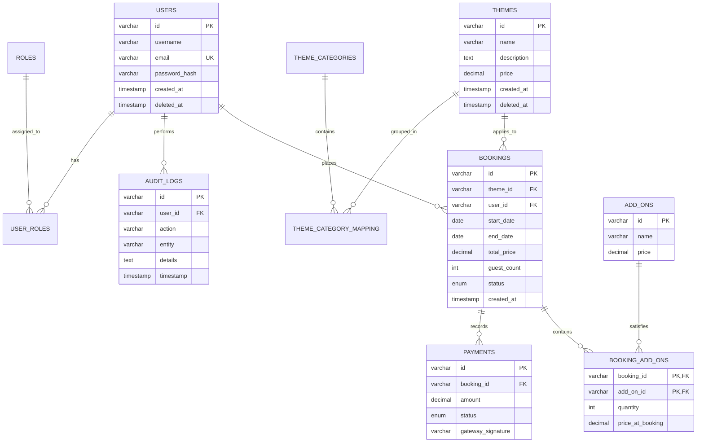

# Database Architecture

The EventPulse database is built on **MySQL 8.0** and is fully normalized (3NF) to ensure data integrity and prevent redundancy. The schema supports the entire lifecycle of user accounts, event catalog management, booking logistics, and financial transactions.

## ER Diagram

## Key Architectural Decisions

1. **UUID Primary Keys**: All tables use `VARCHAR(36)` UUIDs instead of auto-incrementing integers. This prevents resource enumeration and allows decentralized ID generation across microservices.
2. **Historical Financial Accuracy**: The `booking_add_ons` junction table captures `price_at_booking`. If an add-on's global price increases in the future, historical bookings and invoices remain mathematically accurate.
3. **Soft Deletion**: Core entities (`users`, `themes`, `bookings`) implement a `deleted_at` timestamp. This allows for data recovery and preserves referential integrity for historical audits.
4. **Audit Logging**: The `audit_logs` table provides an immutable ledger of system actions (logins, booking creations, cancellations) for security compliance.
