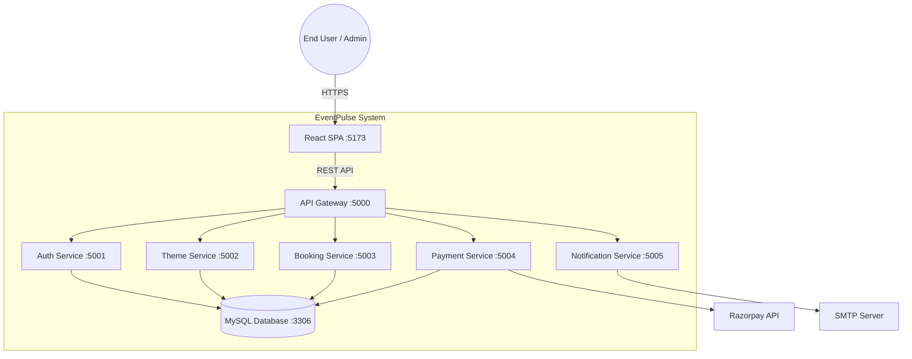

# High-Level Design (HLD)

EventPulse is architected as a decoupled, microservices-based web application. The primary goal of this architecture is to ensure scalability, fault isolation, and independent deployability of domain logic.

## System Context Diagram

## Core Components

### 1. Frontend (React 18 + Vite)
A Single Page Application (SPA) responsible for all user interfaces, including the public catalog, booking calculator, client portal, and admin dashboard. It communicates exclusively with the API Gateway.

### 2. API Gateway (Node.js/Express)
Acts as the single entry point for all frontend requests. 
- **Responsibilities**: Route proxying, Global Rate Limiting (100 req/15min), CORS enforcement, and Request Correlation ID generation.

### 3. Microservices (Node.js/Express)
Domain-driven services that handle specific business logic:
- **Auth Service**: Manages user identity, JWT issuance, and password resets.
- **Theme Service**: Manages the catalog of event packages and add-ons.
- **Booking Service**: Handles date availability, reservations, and CRM functionalities.
- **Payment Service**: Integrates with Razorpay for order creation and HMAC signature verification.
- **Notification Service**: An asynchronous service for dispatching emails and push notifications.

### 4. Data Layer (MySQL 8.0)
A normalized relational database that stores all application state. Services connect to it via a connection pool. A fallback in-memory store exists for rapid local development without a database engine.
