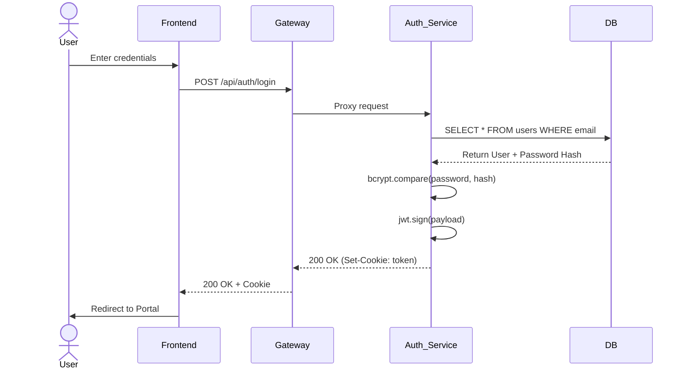
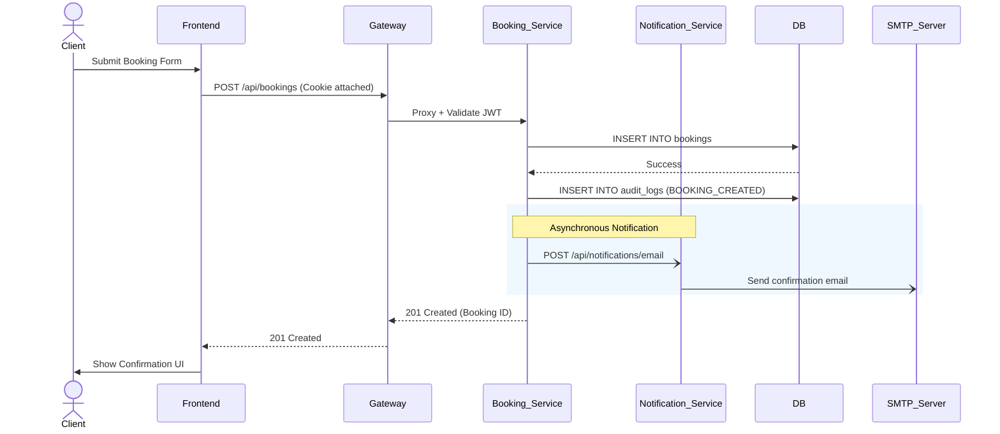
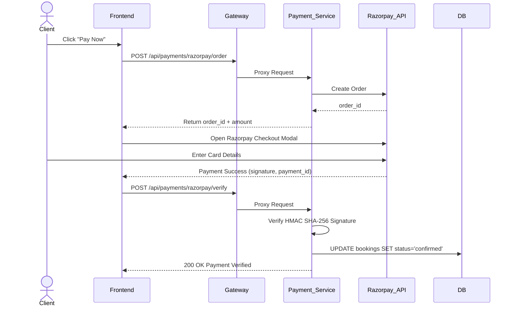

# Sequence Diagrams

## 1. Authentication Flow (Login)

```mermaid
sequenceDiagram
    actor User
    participant Frontend
    participant Gateway
    participant Auth_Service
    participant DB
    
    User->>Frontend: Enter credentials
    Frontend->>Gateway: POST /api/auth/login
    Gateway->>Auth_Service: Proxy request
    Auth_Service->>DB: SELECT * FROM users WHERE email
    DB-->>Auth_Service: Return User + Password Hash
    Auth_Service->>Auth_Service: bcrypt.compare(password, hash)
    Auth_Service->>Auth_Service: jwt.sign(payload)
    Auth_Service-->>Gateway: 200 OK (Set-Cookie: token)
    Gateway-->>Frontend: 200 OK + Cookie
    Frontend->>User: Redirect to Portal
```

## 2. Booking Creation & Notification Flow

```mermaid
sequenceDiagram
    actor Client
    participant Frontend
    participant Gateway
    participant Booking_Service
    participant Notification_Service
    participant DB
    
    Client->>Frontend: Submit Booking Form
    Frontend->>Gateway: POST /api/bookings (Cookie attached)
    Gateway->>Booking_Service: Proxy + Validate JWT
    Booking_Service->>DB: INSERT INTO bookings
    DB-->>Booking_Service: Success
    Booking_Service->>DB: INSERT INTO audit_logs (BOOKING_CREATED)
    
    rect rgb(240, 248, 255)
        Note over Booking_Service,Notification_Service: Asynchronous Notification
        Booking_Service-)Notification_Service: POST /api/notifications/email
        Notification_Service-)SMTP_Server: Send confirmation email
    end
    
    Booking_Service-->>Gateway: 201 Created (Booking ID)
    Gateway-->>Frontend: 201 Created
    Frontend->>Client: Show Confirmation UI
```

## 3. Razorpay Payment Flow

```mermaid
sequenceDiagram
    actor Client
    participant Frontend
    participant Gateway
    participant Payment_Service
    participant Razorpay_API
    
    Client->>Frontend: Click "Pay Now"
    Frontend->>Gateway: POST /api/payments/razorpay/order
    Gateway->>Payment_Service: Proxy Request
    Payment_Service->>Razorpay_API: Create Order
    Razorpay_API-->>Payment_Service: order_id
    Payment_Service-->>Frontend: Return order_id + amount
    
    Frontend->>Razorpay_API: Open Razorpay Checkout Modal
    Client->>Razorpay_API: Enter Card Details
    Razorpay_API-->>Frontend: Payment Success (signature, payment_id)
    
    Frontend->>Gateway: POST /api/payments/razorpay/verify
    Gateway->>Payment_Service: Proxy Request
    Payment_Service->>Payment_Service: Verify HMAC SHA-256 Signature
    Payment_Service->>DB: UPDATE bookings SET status='confirmed'
    Payment_Service-->>Frontend: 200 OK Payment Verified
```
