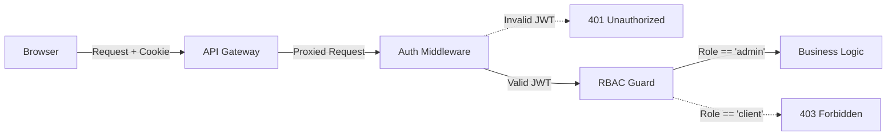

# System Design

This document outlines the detailed system design and structural paradigms utilized in EventPulse.

## Design Patterns

1. **API Gateway Pattern**: A central proxy handles cross-cutting concerns (CORS, Rate Limiting, Request Correlation) before forwarding requests to internal microservices. This prevents the frontend from needing to know the topology of the backend network.
2. **Database per Service (Logical)**: While currently deployed as a single MySQL instance for cost-efficiency, the tables are strictly domain-bounded. Services only query tables relevant to their domain (e.g., Auth service queries `users`, Booking queries `bookings`).
3. **Event-Driven Asynchronous Communication**: The Booking and Payment services trigger emails by firing asynchronous HTTP requests to the Notification service, rather than blocking the main thread to wait for an SMTP server response.

## Security Architecture

- **Authentication**: JWTs are issued upon login and stored in `HttpOnly`, `SameSite=Strict` cookies. This approach immunizes the application against Cross-Site Scripting (XSS) token theft.
- **Authorization (RBAC)**: A centralized `roleMiddleware` validates the `req.user.role` extracted from the JWT payload. Admin routes immediately reject non-admin users with a `403 Forbidden`.
- **Data Validation**: `express-validator` sits in front of mutating endpoints (POST/PUT/PATCH) to sanitize and validate input schemas.

## Error Handling & Resiliency
- Services return standardized JSON error responses `{ error: "Message" }`.
- The API Gateway implements a generic `503 Service Unavailable` fallback if a downstream microservice crashes or becomes unresponsive.
